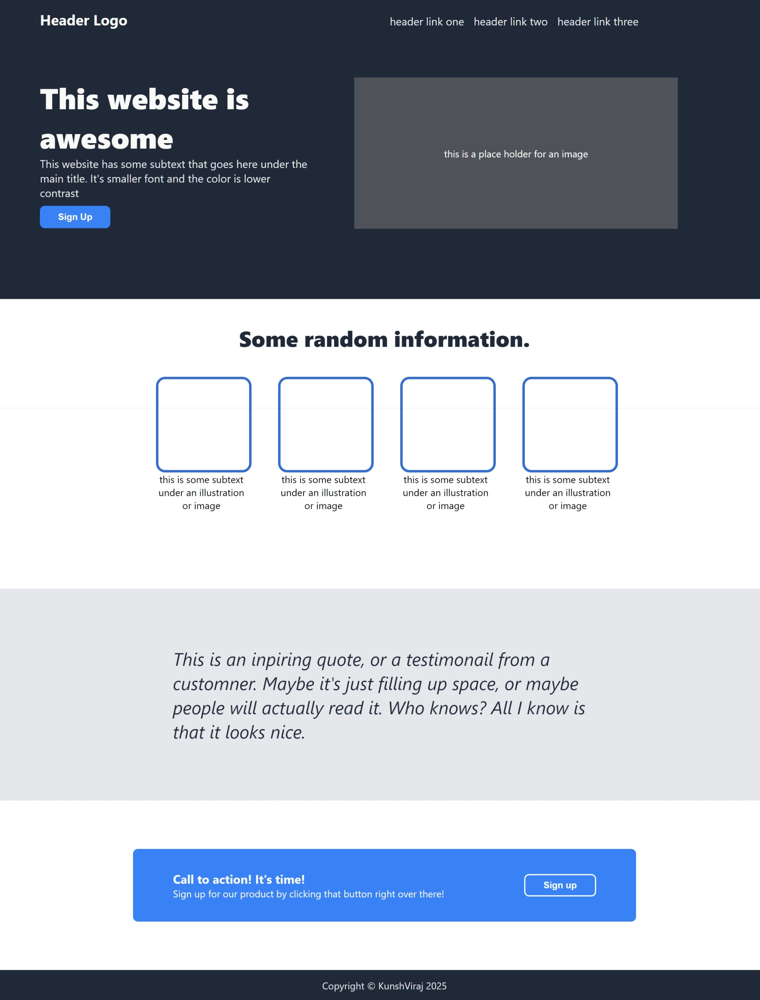

# Landing_Page
# Landing Page Project

## Overview
This is a simple yet visually appealing landing page built using **HTML, CSS, and Flexbox**. The design incorporates a modern layout with depth to enhance user experience. The project follows a structured approach to ensure responsiveness and a clean aesthetic.

## Features
- **Header Navigation:** A fixed header with a logo and navigation links.
- **Hero Section:** A prominent section with a bold title, subtext, call-to-action button, and an image placeholder.
- **Information Section:** A four-column layout presenting random information with image placeholders.
- **Testimonial Section:** A visually highlighted section displaying an inspiring quote.
- **Call-to-Action Section:** A well-placed CTA with a signup button to encourage user interaction.
- **Footer:** A minimal footer with a copyright notice.

## Technologies Used
- **HTML5**: For structuring the webpage.
- **CSS3**: For styling and layout design.
- **Flexbox**: For creating a responsive and flexible layout.



## Folder Structure
```
/landing-page
|-- index.html  # Main HTML file
|-- styles.css  # Stylesheet for the page
|-- images/     # Folder for images (if any)
```

## How to Use
1. Clone or download the repository.
2. Open `index.html` in any modern web browser.
3. Modify `styles.css` to customize the styling as needed.

## Future Improvements
- Adding animations for a more interactive experience.
- Implementing a responsive mobile-first approach.
- Enhancing the design with additional visual effects.

## Credits
Created by **Kunsh Viraj Singh Guleria** following The Odin Project guidelines.
